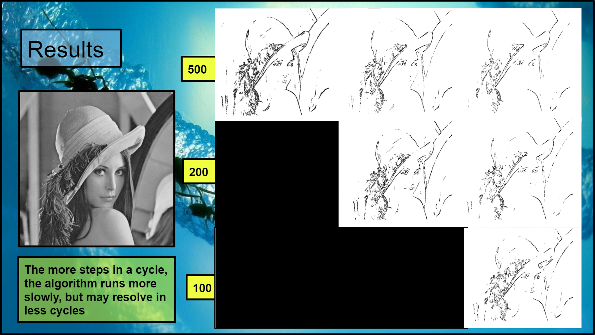

## About Ant Colony Optimization Algorithms
Explanation placeholder

## Program Parameters
The behavior of the ants colony edge detection algorithm is mediated by a variety of parameters. There are a total of nine adjustable parameters in this implementation of the algorithm: 
* number of ants
* pheromone weight factor (alpha)
* pheromone evaporation factor (rho)
* minimum pheromone intensity (tau_min)
* edge visibility weight factor (beta)
* visibility threshold value (b)
* ant memory length
* cycles
* steps per cycle.

## Parameter effects on resulting edgemap

### Alpha and beta

Explanation placeholder

### Evaporation rate

Explanation placeholder

### Number of cycles and steps per cycle

Explanation placeholder

### Number of ants

Explanation placeholder

## Sources and further reading
* Health M, Sarkar S, Sanocki T, Bowyer KW (1998) Comparison of edge detectors: a methodology and initial study. Comput Vis Image Understanding 69 :38–54
* Jing Tian, Weiyu Yu and Shengli Xie, "An ant colony optimization algorithm for image edge detection," 2008 IEEE Congress on Evolutionary Computation (IEEE World Congress on Computational Intelligence), Hong Kong, 2008, pp. 751-756, doi: 10.1109/CEC.2008.4630880.
